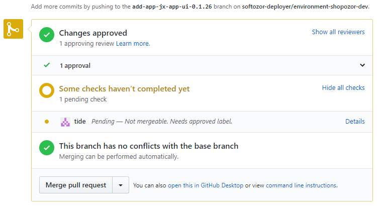

## Useful resources

* [Jenkins X documentation](jenkins-x.io)
* [Test project tutorial](https://blog.testproject.io/2019/10/29/continuous-deployment-with-kubernetes-and-jenkins-x/)

## Jenkins X setup

1. Install `jx` on the cluster with (cf. [documentation](https://jenkins-x.io/docs/getting-started/setup/install/#linux))
```
curl -L "https://github.com/jenkins-x/jx/releases/download/$(curl --silent "https://github.com/jenkins-x/jx/releases/latest" | sed 's#.*tag/\(.*\)\".*#\1#')/jx-linux-amd64.tar.gz" | tar xzv "jx"
mv jx /usr/local/bin
jx --version
```

2. Install `git` on the cluster
```
# download source code
wget https://github.com/git/git/archive/v2.24.1.tar.gz
tar -zxvf v2.24.1.tar.gz
# Install compilation tool
yum install curl-devel expat-devel gettext-devel openssl-devel zlib-devel gcc perl-ExtUtils-MakeMaker
yum remove git
cd git-2.24.1/
make prefix=/usr/local/git all
make prefix=/usr/local/git install

cd ..
rm -rf v2.24.1.tar.gz
rm -rf git-2.24.1/

vi /etc/profile

# add git path at the bottom
export PATH=$PATH:/usr/local/git/bin
# save and exit
source /etc/profile
```
Do not use
```
yum -y install git
```
as you will not get the latest `git` version which is necessary. 

3. Create a github user dedicated to pipelines with a token with the following scope: 

https://github.com/settings/tokens/new?scopes=repo,read:user,read:org,user:email,write:repo_hook,delete_repo

The user needs to be part of the `shopozor` organisation. In case there would be no pipeline user found in a later installation step, try to follow the instructions provided [here](https://github.com/jenkins-x/jx/issues/1679).

4. Bootstrap Jenkins X
```
jx boot
```

5. Add `zadigus` as both a reviewer and an approver in the `shopozor/environment-shopozor-dev` configuration github repository in the `OWNERS` file. Upon your first configuration PR, e.g. upon a
```
jx add app jx-ui
```
you might get the following missing check:



in which case `zadigus` needs to add an `/approve` comment to the PR's discussion, after the review was made. See [this documentation](https://github.com/kubernetes/test-infra/blob/master/prow/plugins/approve/approvers/README.md#lgtm-label) for more information on the topic.

It seems like `jx-ui` is only compatible with the Jenkins X Cloudbees release, therefore not on Jelastic.

Here I experienced many problems:

1. I experienced [this issue](https://github.com/jenkins-x/jx/issues/5418) which I fixed by replacing
```
provider: gke
```
with 
```
provider: kubernetes
```
in file `jenkins-x-boot-config/jx-requirements.yml`.

2. Jenkins X will create by default private git repositories for our configuration. Because it needs a paid subscription on github, I've updated `jx-requirements.yml` like this:
```
environmentGitPublic: true
```
under `cluster` section.

3. Upon calling `jx boot`, at some point I get the error
```
If you are installing Jenkins X on premise you may want to use the '--on-premise' flag or specify the '--external-ip' flags. See: https://jenkins-x.io/getting-started/install-on-cluster/#installing-jenkins-x-on-premise
```
Here I don't know how to proceed, as there is no possibility to set those options to `jx boot` command. Therefore, as a first step, I've run
```
jx install --on-premise
```
But that fails sometime later because it doesn't take the values in `jx-requirements.yml` into account. Also, the `jx install` command is deprecated. So, I followed [this advice](https://github.com/jenkins-x/jx/issues/5496) and updated the value of `ingress.domain` in `jx.requirements.yml` with the domain name of the jelastic environment hosting our cluster.

5. If hooks can't be configured automatically upon `jx import`, double-check [this issue](https://github.com/jenkins-x/jx/issues/370)

6. Handling monorepos can be done as explained [here](https://github.com/jenkins-x/jx/issues/822) or [here](https://jenkins-x.io/docs/using-jx/faq/#how-can-i-use-a-monorepo)

7. Finally, the jenkins X instance needs to have its tls configured.

## Quickstart project

1. Run in the console
```
jx create quickstart --git-public=true
```
to generate a pre-defined quickstart project.